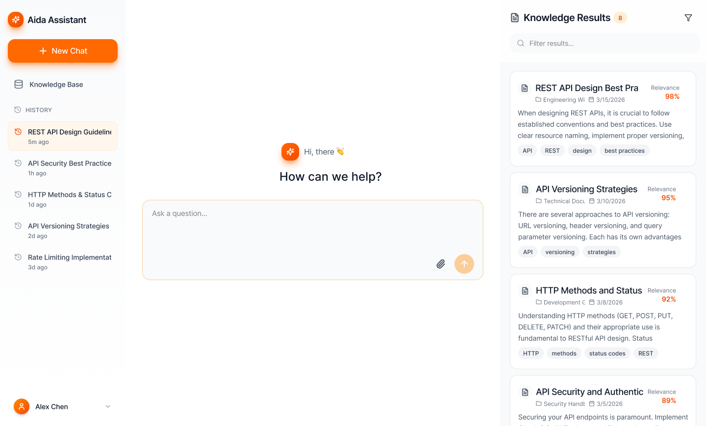
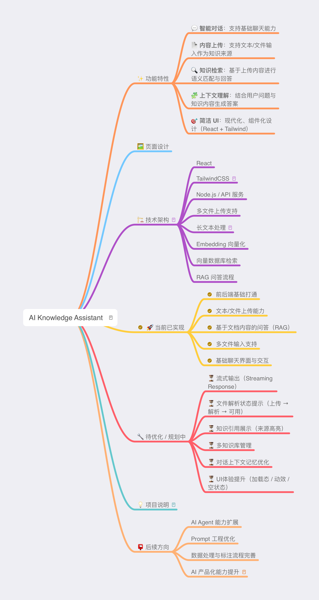

# AI Knowledge Assistant

一个基于 **RAG（Retrieval-Augmented Generation）** 的知识助手应用，支持上传文本/文档，并基于内容进行智能问答。

---

## ✨ 功能特性

* 💬 **智能对话**：支持基础聊天能力
* 📄 **内容上传**：支持文本/文件输入作为知识来源
* 🔍 **知识检索**：基于上传内容进行语义匹配与回答
* 🧩 **上下文理解**：结合用户问题与知识内容生成答案
* 🎯 **简洁 UI**：现代化、组件化设计（React + Tailwind）

---

## 🖼️ 页面设计



---

## 🏗️ 技术架构

**前端**

* React
* TailwindCSS

**后端**

* Node.js / API 服务
* 多文件上传支持
* 长文本处理

**AI能力**

* Embedding 向量化
* 向量数据库检索
* RAG 问答流程

---

## 🚀 当前实现和后续规划


<!-- * ✅ 前后端基础打通
* ✅ 文本/文件上传能力
* ✅ 基于文档内容的问答（RAG）
* ✅ 多文件输入支持
* ✅ 基础聊天界面与交互

---

## 🔧 待优化 / 规划中

* ⏳ 流式输出（Streaming Response）
* ⏳ 文件解析状态提示（上传 → 解析 → 可用）
* ⏳ 知识引用展示（来源高亮）
* ⏳ 多知识库管理
* ⏳ 对话上下文记忆优化
* ⏳ UI体验提升（加载态 / 动效 / 空状态）

--- -->

<!-- ## 📌 使用方式 -->
<!--
```bash
# 安装依赖
npm install

# 启动前端
npm run dev

# 启动后端
npm run server
```

--- -->

<!-- ## 💡 项目说明

本项目从实际产品体验出发，结合 AI 知识助手的使用场景，
设计并实现了完整的用户流程与页面结构，并持续优化中。

---

## 📮 后续方向

* AI Agent 能力扩展
* Prompt 工程优化
* 数据处理与标注流程完善
* AI 产品化能力提升

--- -->

> 如果这个项目对你有帮助，欢迎 ⭐️
